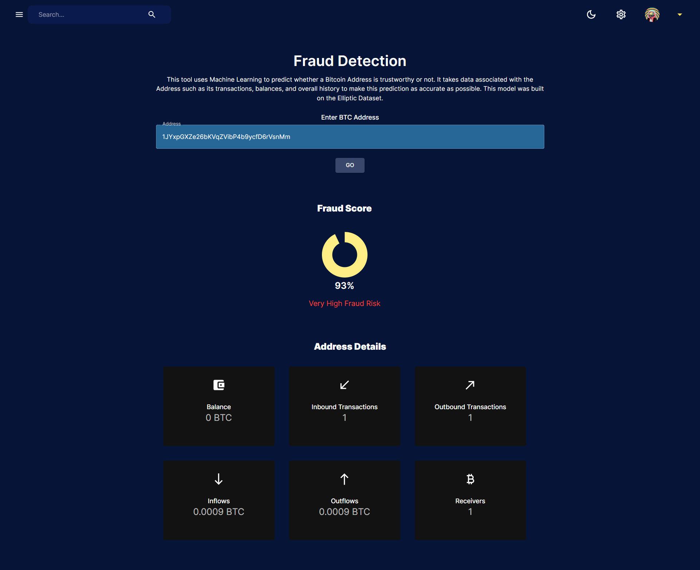

# Wallet Watch - Bitcoin Address Classifier using Machine Learning

## Description
Wallet Watch is a web-platform built on the MERN Stack designed to classify Bitcoin (BTC) addresses as fraudulent or non-fraudulent using Machine Learning. This tool is essential for users who wish to verify the integrity of BTC addresses before proceeding with transactions, providing a safeguard against fraudulent activities.

The platform can be used at https://wallet-watch-frontend.onrender.com/fraud-detection
**However, the main functionality (the model) does not work on this link currently due to hosting server limitations**

## Key Features
- **BTC Address Classifier**: Enter a BTC address to receive a fraud score indicating the likelihood of the address being fraudulent.
- **Global Cryptocurrency Dashboard/Overview**: Stay updated with the latest trends and data in the cryptocurrency market.
- **News Dashboard**: Access the latest news related to cryptocurrencies.
- **Whitelisting (Coming Soon)**: A feature to whitelist trusted BTC addresses for quicker verification.

## Table of Contents
- [Installation](#installation)
- [Dataset](#dataset)
- [Usage](#usage)
- [Screenshots](#screenshots)
- [Configuration](#configuration)
- [Contributing](#contributing)
- [License](#license)
- [Authors and Acknowledgments](#authors-and-acknowledgments)
- [Contact Information](#contact-information)

## Installation

### Prerequisites
- Python 3
- Node.js
- React
- Express

### Steps
1. Clone the repository:
   ```sh
   git clone https://github.com/liftoff24/wallet-watch
2. Install server dependencies:
   ```sh
   cd server
   npm install && pip install -r requirements.txt
3. Start the backend
   ```sh
   npm run start
4. Install client dependencies
   ```sh
   cd ../client
   npm install
5. Start the frontend
   ```sh
   npm run start

## Dataset
The dataset utilized for this project is the **Elliptic++ Dataset**, which is a modified version of the Elliptic Dataset. This dataset is publicly recognized as the world's largest labeled dataset of Bitcoin addresses and transactions. It is designed specifically to advance the development of new techniques for detecting illicit cryptocurrency addresses and transactions. The base dataset comprises over 800,000 wallet addresses and 200,000 Bitcoin transactions. These transactions contain labels identifying whether they were conducted by criminal actors, providing the basis for the classifying model that this project aims to develop.

### Data Cleaning Process
The original Elliptic++ dataset contains over 50 features, and its size could pose processing limitations. Therefore, significant data cleaning was required to prepare a usable dataset for developing the project's model. Key features important to the model's functionality were identified, focusing on classifying between licit and illicit addresses. This refinement process aimed to simplify the dataset and enhance the model's efficiency​.

Key features selected for the model include:
1. Bitcoin Address – The address of the Bitcoin wallet.
2. Class – The classification of the address, either Licit or Illicit.
3. Outbound Transactions – The number of outbound transactions.
4. Inbound Transactions – The number of inbound transactions.
5. Total Transactions – The total number of transactions.
6. Total BTC Transacted – The total amount of Bitcoin transacted by the address.
7. BTC Outflows – The total amount of Bitcoin sent out.
8. BTC Inflows – The total amount of Bitcoin received

**Dataset Class Statistics**


**Dataset Graph Structure**


To enhance the model's training process, the initial class of 'Unknown' wallet addresses was removed to create a binary classification model. This adjustment helped in focusing on detecting licit versus illicit addresses exclusively. Refining and cleaning the dataset reduced its complexity, which increased model efficiency, reduced computational load, and improved processing times. The concentration on transaction dynamics from the refined dataset features allowed the model to better capture transaction and address behaviors crucial for identifying fraud​.

**Dataset Refining**


The dataset preparation involved extensive cleaning and feature selection to ensure the model could efficiently and accurately classify Bitcoin addresses. The process included eliminating unnecessary features and focusing on the most relevant ones to improve the model's predictive performance.

## Usage
To use Wallet Watch, simply navigate to the main/home page of the platform. Enter the BTC address you wish to check into the provided input field. The platform will return a fraud score, indicating the likelihood of the address being fraudulent.

## Platform Screenshots

### Main Page


### BTC Address Classification


### Overview Page


### Cryptocurrencies Page


### Cryptocurrency Details Page


### News Page


## Configuration
No additional configuration is required for this project.

## Contributing
Currenctly, contributions are not being accepted for this project.

## License
This project does not have a license.

## Authors and Acknowledgements
Author: Dineth Minol Wijesinghe Wiyannalage

## Contact Information
For any questions, support, or opportunities, please reach out to me at minol24112000@gmail.com